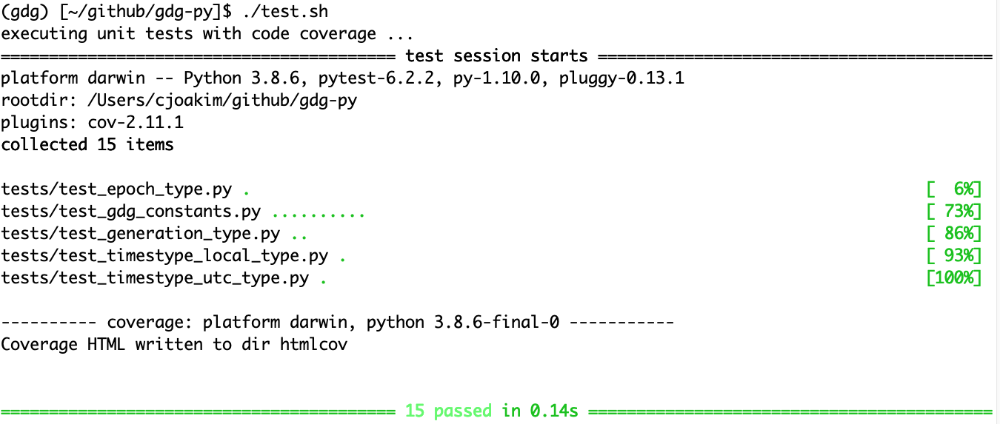
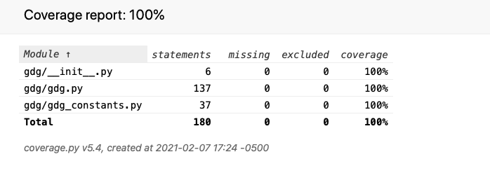

# gdg-py

home of the gdg python library - generation data groups

## IBM zOS

- https://www.ibm.com/support/knowledgecenter/zosbasics/com.ibm.zos.zconcepts/zconcepts_175.htm

Advantages to grouping related data sets include:

- All of the data sets in the group can be referred to by a common name.
- The operating system is able to keep the generations in chronological order.
- Outdated or obsolete generations can be automatically deleted by the operating system.

## PyTest Test Results 2021/02/07

### Unit Tests

### Code Coverage

